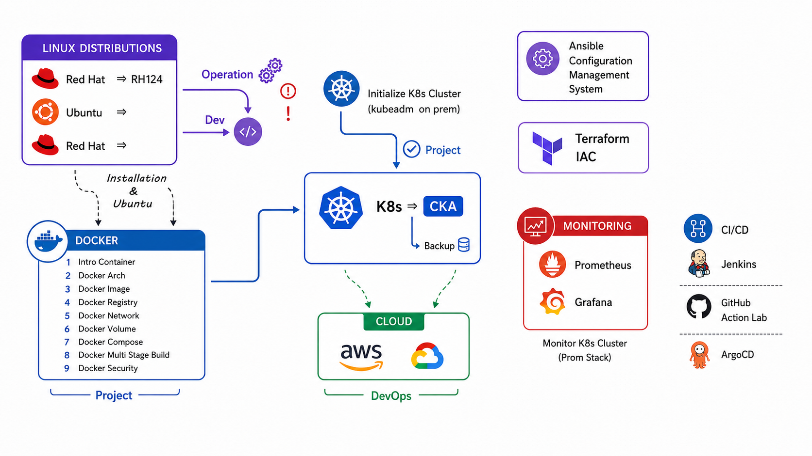
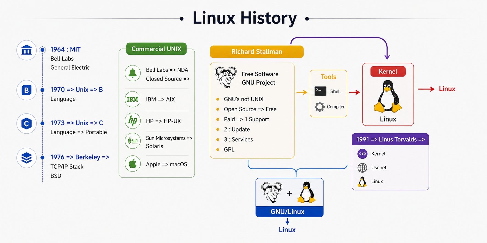
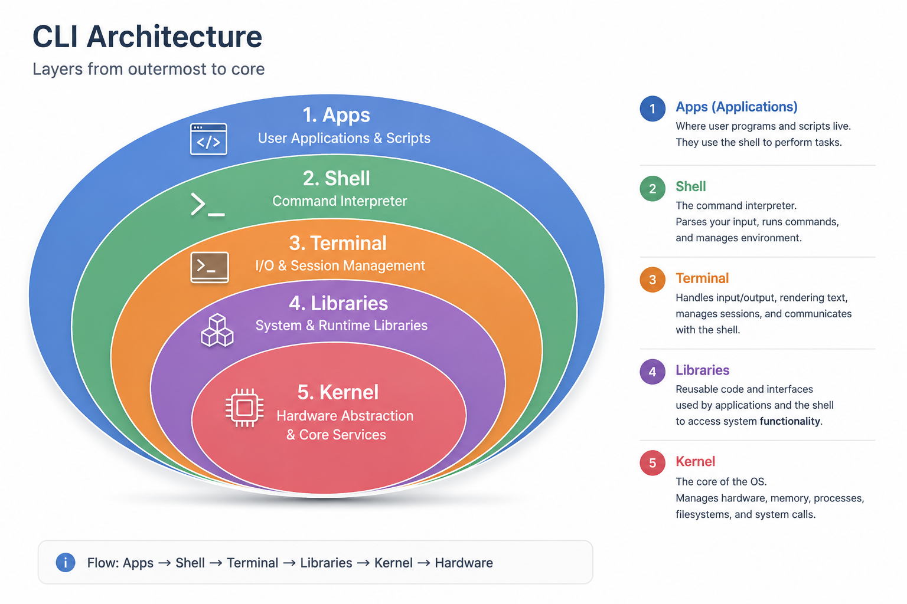
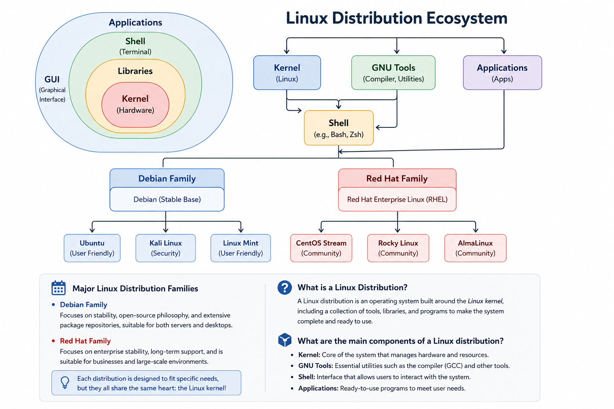
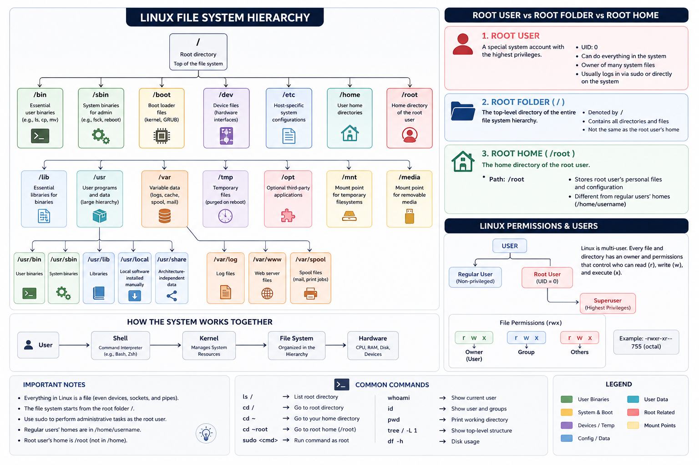

# Linux File System Hierarchy

## Question 1
What is the top-level directory in Linux?

- A) /root
- B) /home
- ✅ C) /
- D) /usr

---

## Question 2
Which directory contains user home directories?

- A) /usr
- ✅ B) /home
- C) /etc
- D) /var

---

## Question 3
Which directory stores system configuration files?

- ✅ A) /etc
- B) /var
- C) /tmp
- D) /bin

---

## Question 4
Which directory contains essential user command binaries?

- A) /var
- B) /home
- ✅ C) /bin
- D) /opt

---

## Question 5
Where are temporary files usually stored?

- ✅ A) /tmp
- B) /etc
- C) /boot
- D) /usr

---

## Question 6
Which directory contains system log files?

- A) /usr
- ✅ B) /var
- C) /boot
- D) /lib

---

## Question 7
Which directory contains the Linux kernel and bootloader files?

- ✅ A) /boot
- B) /etc
- C) /var
- D) /home

---

## Question 8
Which directory contains system libraries needed by programs in /bin and /sbin?

- A) /usr
- ✅ B) /lib
- C) /opt
- D) /tmp

---

## Question 11
Which directory contains user-specific files for the root user?

- A) /home/root
- ✅ B) /root
- C) /usr/root
- D) /var/root

---

## Question 12
Which directory contains most user-installed programs and applications?

- ✅ A) /usr
- B) /tmp
- C) /home
- D) /boot

---

## Question 13
Which directory contains device files?

- ✅ A) /dev
- B) /etc
- C) /var
- D) /boot

---

## Question 15
In Linux, what does the root directory (/) represent?

- A) The administrator folder
- ✅ B) The highest directory in the filesystem
- C) User home directory
- D) Temporary storage

---

## Question 16
What is the main purpose of the /home directory in Linux?

- A) Store system configuration files
- ✅ B) Store user personal directories
- C) Store system logs
- D) Store kernel files
