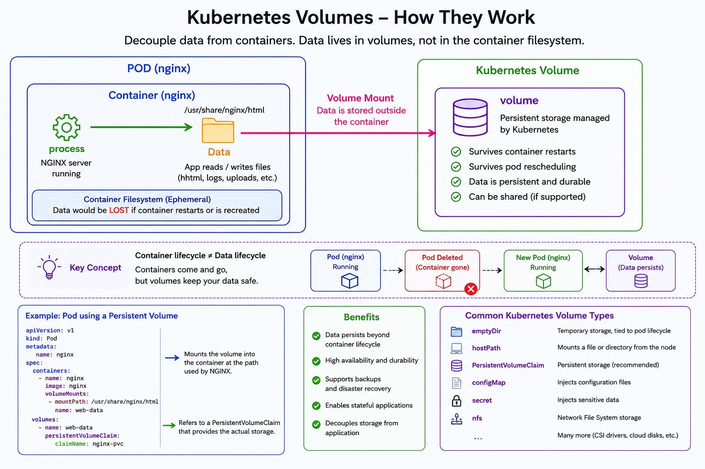
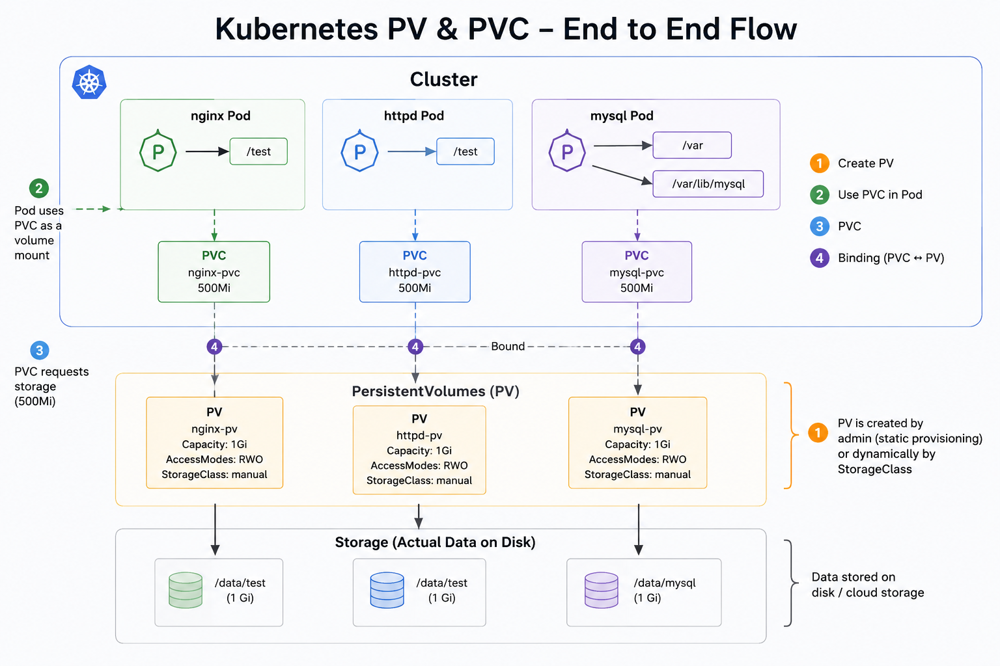

# Kubernetes Volume Explanation




# Kubernetes Volumes – How They Work

## Core Idea

Kubernetes volumes are used to store data outside the container filesystem so that data survives container restarts, pod recreation, or rescheduling.

Containers are **ephemeral** (temporary), but volumes provide **persistent storage**.

---

# Architecture Overview

```text
Pod
└── Container (nginx)
    ├── Process running (NGINX server)
    ├── Reads/Writes data
    │   └── /usr/share/nginx/html
    └── Volume Mount
            ↓
      Kubernetes Volume
```

The container mounts a volume at a path such as:

```bash
/usr/share/nginx/html
```

Applications can then read and write files there.

---

# Why Volumes Matter

## Without Volumes

- Data is stored inside the container filesystem
- If the container restarts or is recreated:
  - logs disappear
  - uploads disappear
  - generated files disappear

## With Volumes

- Data survives container restarts
- Data survives pod deletion/recreation
- Storage is managed independently from containers

---

# Key Concept

## Container Lifecycle ≠ Data Lifecycle

Containers come and go.

Volumes keep data safe.

### Example Lifecycle

```text
Pod Running
    ↓
Pod Deleted
    ↓
New Pod Created
    ↓
Volume Still Exists
```

The new pod can reconnect to the same persistent data.

---

# Kubernetes Volume Benefits

## Advantages

- Persistent data storage
- Better durability
- Supports backups
- Enables stateful applications
- Decouples storage from application containers
- Can be shared between containers (depending on storage type)

---

# Example: Pod Using a Persistent Volume

```yaml
apiVersion: v1
kind: Pod

metadata:
  name: nginx

spec:
  containers:
    - name: nginx
      image: nginx

      volumeMounts:
        - mountPath: /usr/share/nginx/html
          name: web-data

  volumes:
    - name: web-data
      persistentVolumeClaim:
        claimName: nginx-pvc
```

---

# Explanation of the YAML

## `volumeMounts`

```yaml
mountPath: /usr/share/nginx/html
```

Mounts the volume inside the container at this path.

```yaml
name: web-data
```

References the volume definition below.

---

## `volumes`

```yaml
persistentVolumeClaim:
  claimName: nginx-pvc
```

Connects the pod to persistent storage through a PVC.

---

# Common Kubernetes Volume Types

| Volume Type | Purpose |
|---|---|
| `emptyDir` | Temporary storage tied to pod lifecycle |
| `hostPath` | Mounts files/directories from node |
| `PersistentVolumeClaim` | Persistent storage (recommended) |
| `configMap` | Injects configuration files |
| `secret` | Injects sensitive data |
| `nfs` | Shared network filesystem storage |

---

# Important Distinction

## Container Filesystem

- Temporary
- Deleted when container dies
- Fast but not durable

## Kubernetes Volume

- Persistent
- Independent of container lifecycle
- Durable and manageable by Kubernetes

---

# Real-World Example

Imagine a web app where users upload images.

## Without a Volume

```text
Container restart = all uploads lost
```

## With a Persistent Volume

```text
Container restart = uploads remain
```

---

# Simple Mental Model

Think of:

- **Container** = running application
- **Volume** = external hard drive attached to it

You can destroy and recreate the application, while the storage remains intact.

---

# Summary

Kubernetes volumes:

- Separate storage from containers
- Provide persistent data
- Survive restarts and rescheduling
- Enable production-ready stateful applications

They are essential for databases, uploads, logs, and any workload that needs durable storage.



# Kubernetes PV & PVC – End-to-End Flow

## Overview

This diagram explains how:

- Pods use storage in Kubernetes
- PVCs request storage
- PVs provide storage
- Real disk/cloud storage stores the actual data

The full flow is:

```text
Pod → PVC → PV → Physical Storage
```

---

# Core Components

## 1. Pod

A Pod runs containers and applications.

Examples in the diagram:

- nginx Pod
- httpd Pod
- mysql Pod

Pods need storage to:

- store files
- store databases
- store uploads
- persist logs

---

## 2. PersistentVolumeClaim (PVC)

A PVC is a **request for storage** made by a Pod.

Example:

```yaml
resources:
  requests:
    storage: 500Mi
```

The PVC says:

> "I need 500Mi of persistent storage."

Examples in the diagram:

- nginx-pvc
- httpd-pvc
- mysql-pvc

---

## 3. PersistentVolume (PV)

A PV is the **actual storage resource** available in the cluster.

Examples:

- nginx-pv
- httpd-pv
- mysql-pv

Each PV contains:

- Capacity
- Access mode
- Storage class
- Actual storage backend

Example:

```yaml
capacity:
  storage: 1Gi
```

---

## 4. Actual Storage

At the bottom of the diagram is the real storage.

Examples:

```text
/data/test
/data/mysql
```

This storage may exist on:

- local disk
- SSD
- NFS
- AWS EBS
- Azure Disk
- Google Persistent Disk
- cloud storage systems

This is where the actual data lives.

---

# Complete Flow

## Step 1 – Create PV

The administrator or StorageClass creates a PV.

Example:

```yaml
apiVersion: v1
kind: PersistentVolume
```

The PV provides storage to the cluster.

Diagram examples:

| PV       | Capacity |
| -------- | -------- |
| nginx-pv | 1Gi      |
| httpd-pv | 1Gi      |
| mysql-pv | 1Gi      |

---

## Step 2 – Pod Uses PVC

The Pod does not use the PV directly.

Instead:

```text
Pod → PVC
```

The Pod mounts the PVC as a volume.

Example mount paths from the diagram:

| Pod       | Mount Path       |
| --------- | ---------------- |
| nginx Pod | `/test`          |
| httpd Pod | `/test`          |
| mysql Pod | `/var`           |
| mysql Pod | `/var/lib/mysql` |

---

## Step 3 – PVC Requests Storage

PVC requests storage from Kubernetes.

Example:

```yaml
apiVersion: v1
kind: PersistentVolumeClaim
```

Example request:

```yaml
resources:
  requests:
    storage: 500Mi
```

The PVC asks for:

- storage size
- access mode
- storage class

---

## Step 4 – Binding (PVC ↔ PV)

Kubernetes matches the PVC with a suitable PV.

This process is called:

```text
Binding
```

Example:

```text
nginx-pvc  → nginx-pv
httpd-pvc  → httpd-pv
mysql-pvc  → mysql-pv
```

Requirements must match:

- enough capacity
- same access mode
- same storage class

Once matched:

```text
PVC status = Bound
```

---

# Understanding the Diagram Flow

```text
Application inside Pod
        ↓
Uses mounted volume
        ↓
PVC requests storage
        ↓
PVC binds to PV
        ↓
PV maps to real disk/cloud storage
        ↓
Data stored persistently
```

---

# Storage Capacity Example

From the diagram:

## PVC Request

```text
500Mi
```

## PV Capacity

```text
1Gi
```

This works because:

```text
1Gi > 500Mi
```

The PV has enough storage for the PVC request.

---

# Access Modes

The diagram uses:

```text
RWO
```

Meaning:

```text
ReadWriteOnce
```

This allows:

- one node to mount the volume as read/write

Common access modes:

| Mode | Meaning       |
| ---- | ------------- |
| RWO  | ReadWriteOnce |
| ROX  | ReadOnlyMany  |
| RWX  | ReadWriteMany |

---

# StorageClass

The diagram shows:

```text
StorageClass: manual
```

StorageClass defines:

- how storage is provisioned
- storage type
- performance
- reclaim policy

Two provisioning methods:

## Static Provisioning

Admin manually creates PVs.

## Dynamic Provisioning

Kubernetes automatically creates PVs using StorageClass.

---

# Why PVC Exists

Pods should not directly depend on actual disks.

PVC provides abstraction.

Benefits:

- portability
- flexibility
- easier scaling
- easier storage replacement

Without changing the Pod, admins can:

- move storage
- resize storage
- change backend storage systems

---

# MySQL Example

The mysql Pod stores database files in:

```text
/var/lib/mysql
```

Without persistent storage:

```text
Pod restart = database lost
```

With PV + PVC:

```text
Database survives restart
```

This is critical for:

- databases
- enterprise apps
- production systems

---

# Real-World Analogy

Think of it like this:

| Kubernetes Component | Real World Example    |
| -------------------- | --------------------- |
| Pod                  | Person using computer |
| PVC                  | Storage request form  |
| PV                   | Allocated hard drive  |
| Physical Storage     | Actual disk hardware  |

---

# Key Benefits of PV & PVC

## Persistent Data

Data survives pod restarts.

## Decoupled Storage

Applications are separated from storage implementation.

## Dynamic Provisioning

Storage can be automatically created.

## Scalability

Easy to increase storage resources.

## Portability

Applications work across environments.

---

# Important Distinction

## PVC

A request for storage.

```text
"I need 500Mi storage."
```

## PV

The actual storage resource.

```text
"Here is 1Gi storage."
```

---

# Full End-to-End Lifecycle

```text
1. Admin creates PV
        ↓
2. User creates PVC
        ↓
3. Kubernetes binds PVC to PV
        ↓
4. Pod mounts PVC
        ↓
5. Application reads/writes data
        ↓
6. Data stored persistently on disk/cloud
```

---

# Summary

Kubernetes storage flow:

```text
Pod → PVC → PV → Storage
```

Where:

- Pod uses storage
- PVC requests storage
- PV provides storage
- Physical storage stores the data

This architecture enables:

- persistent applications
- databases
- scalable workloads
- reliable production systems