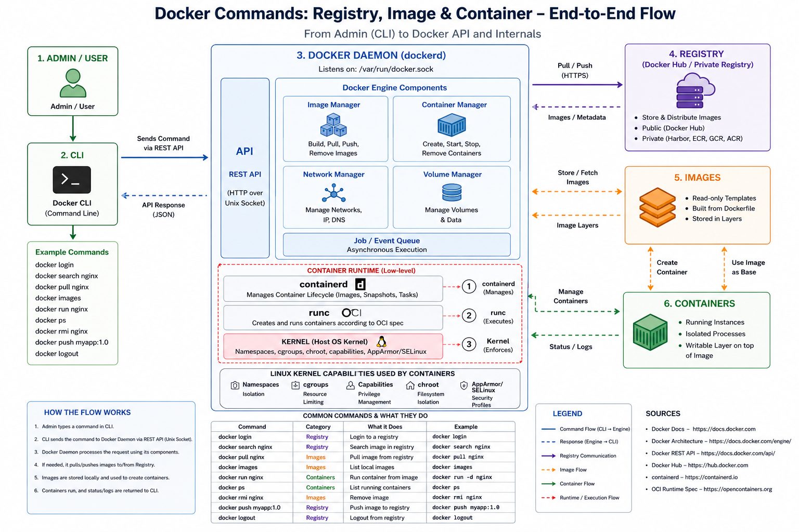

# Docker Registry

A Docker registry is a storage and distribution system for Docker images.

## Think of it like

- GitHub → stores code repositories
- Docker Registry → stores Docker images
# Docker Login Example

```bash
 docker login -u sawsananwar

i Info → A Personal Access Token (PAT) can be used instead.
         To create a PAT, visit https://app.docker.com/settings

Password:

WARNING! Your credentials are stored unencrypted in '/root/.docker/config.json'.
Configure a credential helper to remove this warning. See
https://docs.docker.com/go/credential-store/

Login Succeeded
```


# Docker Search Images


```bash
 $ docker search images

NAME                      DESCRIPTION                                     STARS     OFFICIAL
iron/images               docker images                                   8
bugswarm/images           The official repository for BugSwarm artifacts   0
wwdemo/images                                                             0
ebonharme/images          Docker images built automatically               1
investdefy/images                                                         1
scrutinizer/images                                                        0
pippoxxl/images                                                           0
```

## Docker Images Command

```bash
$ docker images

i Info → U = In Use

REPOSITORY   TAG       IMAGE ID       CREATED       SIZE
```

# Pull Nginx Docker Image

```bash
root@controlplane:~$ docker pull nginx
```
# Push Nginx Docker Image

```bash
root@controlplane:~$ docker push nginx
```
# Remove Docker Image (`docker rmi`)

## Command

```bash
root@controlplane:~$ docker rmi nginx
```
Untagged: nginx:latest
Untagged: nginx@sha256:06aa3d7be10bc6307990c81bdca075793132e9163391abc370c015e344e23128

Deleted: sha256:6f8edba05e380a2dcd013045301ccc3485623f8e09d1faf34d30376eec576889
Deleted: sha256:51e392cc5c13f22adcf6b85dd692e02ef93107495fa04074322426f920a01893
Deleted: sha256:186a25419fb7cfe03118e1ce63acf7e79943c54649e78dcd98f30bec06884e1c
Deleted: sha256:bd0da92921a42ec8fa33b76a053540e3a927f14ff36d128f36202f73ee76a8ba
Deleted: sha256:e5fce85cdb935225179bd4dd620753e2f6eef4d2e5ab8baf9caed92186646b81
Deleted: sha256:6c8a6fa35fe24ef7f13ef3770c5ae5d86f838fe8424362a8d461deb099541897
Deleted: sha256:b8c6db221eb7bb0983101ff934cee5e903032f005760ff620390ec23c2d51d25
Deleted: sha256:79dd1f4c855cd061f687a994426634cf5f84c8ecdbc66c7a7d118e828dd93c99

## Explanation

### `docker rmi nginx`
Removes the `nginx` Docker image from the local system.

### `Untagged`
Docker removed the image tag (`latest`) linked to the image.

### `Deleted`
Docker deleted the image layers stored on disk.

### `sha256`
Unique ID/hash for Docker image layers.

---

## Important Notes

- `rmi` stands for **remove image**
- You cannot remove an image if a container is currently using it
- Removing an image frees disk space





# Docker Create Container Example

```bash

root@controlplane:~$ docker ps -a

CONTAINER ID   IMAGE     COMMAND   CREATED   STATUS    PORTS     NAMES

root@controlplane:~$ docker pull nginx

Using default tag: latest
latest: Pulling from library/nginx

57fb71246055: Pull complete
60ad0c2ccfc6: Pull complete
834a05acfff4: Pull complete
1bb34ee717a4: Pull complete
9f7bde970101: Pull complete
030365c1a354: Pull complete
735e1c628373: Pull complete

Digest: sha256:06aa3d7be10bc6307990c81bdca075793132e9163391abc370c015e344e23128

Status: Downloaded newer image for nginx:latest

docker.io/library/nginx:latest

root@controlplane:~$ docker create nginx

23a2f40ec09395b21754a124f3ccaa2f89cf27baeaac2c5f2c3f4cce1eb0c9a3

root@controlplane:~$ docker ps -a

CONTAINER ID   IMAGE     COMMAND                  CREATED          STATUS    PORTS     NAMES
23a2f40ec093   nginx     "/docker-entrypoint.…"   44 seconds ago   Created             elegant_germain
```

## Explanation

- `docker ps -a` → Shows all containers (running and stopped)
- No containers existed initially
- `docker pull nginx` → Downloads the nginx image from Docker Hub
- `latest` → Default image tag/version
- `Pull complete` → Docker downloaded all image layers successfully
- `Digest` → Unique SHA256 hash of the image
- `docker create nginx` → Creates a container from the nginx image
- Container is created but not started
- `23a2f40ec093...` → Container ID
- `STATUS = Created` → Container exists but is not running yet
- `NAMES` → Docker automatically generated the container name (`elegant_germain`)
- `COMMAND` → Default startup command inside the container
# Docker Start Container Example

```bash
root@controlplane:~$ docker ps -a

CONTAINER ID   IMAGE     COMMAND                  CREATED          STATUS    PORTS     NAMES
23a2f40ec093   nginx     "/docker-entrypoint.…"   44 seconds ago   Created             elegant_germain

root@controlplane:~$ docker start nginx

Error response from daemon: No such container: nginx
failed to start containers: nginx

root@controlplane:~$ docker start 23a2f40ec093

23a2f40ec093

root@controlplane:~$ docker ps -a

CONTAINER ID   IMAGE     COMMAND                  CREATED          STATUS         PORTS     NAMES
23a2f40ec093   nginx     "/docker-entrypoint.…"   14 minutes ago   Up 5 seconds   80/tcp    elegant_germain
```


## Explanation

- `docker ps -a` → Shows all containers
- `STATUS = Created`
    - Container exists but is not running yet
- `docker start nginx`
    - Failed because `nginx` is the image name, not the container name
- `No such container: nginx`
    - Docker could not find a container with that name
- `docker start 23a2f40ec093`
    - Starts the container using the container ID
- `STATUS = Up`
    - Container is now running successfully
- `80/tcp`
    - The container exposes port 80 internally
- `elegant_germain`
    - Auto-generated container name by Docker
